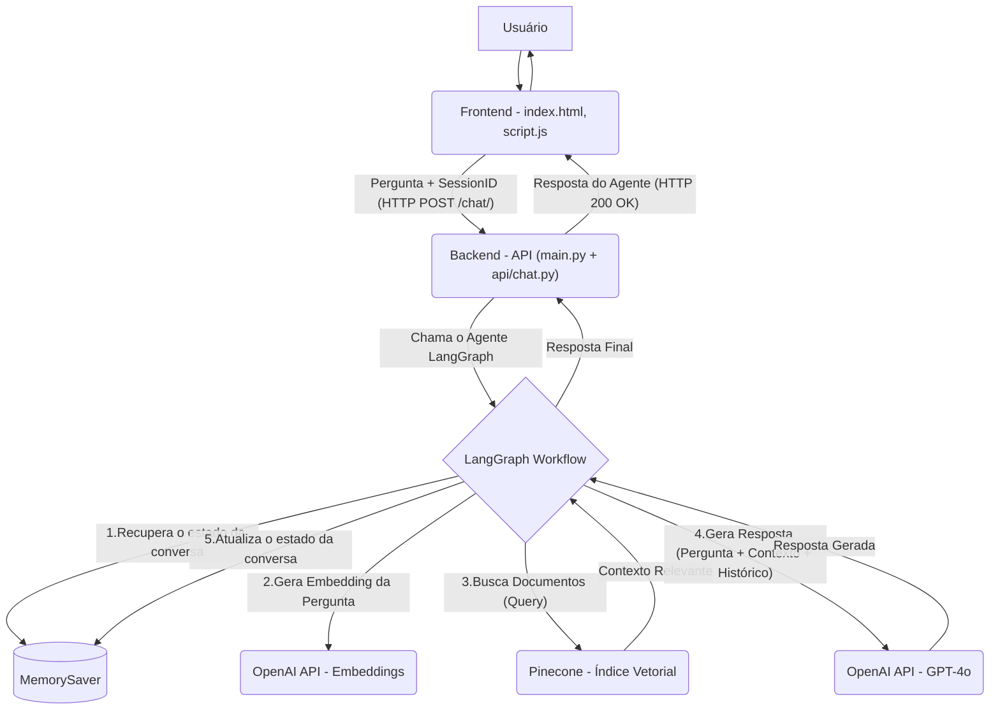

# Agente de IA com Memória Conversacional

Um agente de IA para atendimento em uma interface web com base em documentos PDF. O agente agora possui memória, lembrando-se do contexto de interações passadas em uma mesma sessão.

O objetivo deste projeto é aprender a usar um agente de IA para atender usuários com base em conhecimentos específicos, utilizando uma arquitetura modular e escalável que facilita a manutenção e a adição de novas funcionalidades.

### Principais Novidades da Versão Modular

- **Arquitetura Refatorada:** O código foi reestruturado em módulos (API, Serviços, Configurações), seguindo as melhores práticas de desenvolvimento com FastAPI.
- **Memória de Conversa:** Utilizando **LangGraph**, o agente agora mantém o histórico completo da conversa por sessão, permitindo respostas mais ricas e contextuais.
- **Manutenibilidade Aprimorada:** A separação de responsabilidades torna o código mais limpo, fácil de entender, testar e expandir.

## Tecnologias Utilizadas

- Python
- FastAPI
- Pinecone
- LangChain & **LangGraph**
- OpenAI GPT-4o
- HTML/CSS/JavaScript

## Funcionalidades

- Ingestão de múltiplos PDFs para criação de base de conhecimento.
- Busca semântica para encontrar informações relevantes nos documentos.
- **Memória e Histórico de Conversa:** O agente se lembra das interações anteriores na mesma sessão.
- Geração de respostas contextualizadas com base nos documentos e no histórico.
- Endpoints para gerenciar o histórico da conversa (consultar e limpar).

## Arquitetura do Sistema

O diagrama abaixo mostra o fluxo de dados da aplicação para uma única interação.



### Descrição do Fluxo

1.  O usuário faz uma pergunta através do frontend, que também gerencia um `session_id`.
2.  O frontend envia a pergunta e o `session_id` para o backend (`/api/chat/`).
3.  A API aciona o **LangGraph**, que primeiro recupera o histórico da conversa para o `session_id` informado.
4.  O agente busca em sua base de conhecimento (Pinecone) por informações relevantes para a pergunta atual.
5.  Os trechos de contexto encontrados são enviados ao LLM (GPT-4o) **junto com a pergunta atual e todo o histórico da conversa**.
6.  A resposta gerada é retornada ao frontend, e o estado da conversa é salvo para a próxima interação.

## Como Começar

Siga estas instruções para configurar e executar o projeto em seu ambiente local.

#### Pré-requisitos

- Python 3.9+
- Git (opcional, mas recomendado)
- Um editor de código como o VS Code

---

#### 1. Configuração do Ambiente

1.  **Clone o Repositório**:
    ```bash
    git clone [https://github.com/yuri-moraes/agente-ia.git](https://github.com/yuri-moraes/agente-ia.git)
    cd agente-ia
    ```

2.  **Crie e Ative um Ambiente Virtual**:
    ```bash
    # Criar o ambiente
    python -m venv venv

    # Ativar no Windows
    .\venv\Scripts\activate

    # Ativar no macOS/Linux
    source venv/bin/activate
    ```

3.  **Instale as Dependências**:
    ```bash
    pip install -r requirements.txt
    ```

#### 2. Configuração das Variáveis de Ambiente

1.  Na raiz do projeto, crie um arquivo chamado `.env`.
2.  Adicione suas chaves de API:
    ```dotenv
    OPENAI_API_KEY="sua_chave_da_openai_aqui"
    PINECONE_API_KEY="sua_chave_do_pinecone_aqui"
    ```

#### 3. Ingestão dos Dados (Base de Conhecimento)

Este passo processa seus documentos PDF e os armazena no Pinecone.

1.  Coloque seus arquivos PDF (ex: `manual_produto_A.pdf`) na pasta raiz do projeto.
2.  Execute o script de ingestão:
    ```bash
    python ingest_data.py
    ```
    Aguarde a mensagem de "Processamento completo!".

#### 4. Executando o Backend (API FastAPI)

1.  Certifique-se de que seu ambiente virtual (`venv`) esteja ativo.
2.  No terminal, execute o servidor a partir do `main.py`:
    ```bash
    python main.py
    ```
    **Ou**, para desenvolvimento com recarregamento automático:
    ```bash
    uvicorn main:app --reload --host 0.0.0.0 --port 8000
    ```
    - O servidor estará disponível em `http://localhost:8000`.
    - Acesse a documentação interativa da API em `http://localhost:8000/docs`.

#### 5. Executando o Frontend (Interface Web)

1.  No seu explorador de arquivos, clique duas vezes no arquivo `index.html` para abri-lo no navegador.
2.  **Alternativa (Recomendado):** Se usar o VS Code, instale a extensão **"Live Server"**, clique com o botão direito em `index.html` e selecione "Open with Live Server".

Agora você pode interagir com seu agente! Tente fazer perguntas em sequência para testar a memória da conversa.

## Estrutura de Arquivos

A nova estrutura modular do projeto organiza o código por responsabilidades.

```bash
agente-ia/
├── .venv/                  # Ambiente virtual Python
├── api/                    # Módulo da API (Endpoints FastAPI)
│   └── chat.py             # Roteador para os endpoints de chat
├── core/                   # Configurações centrais
│   └── config.py           # Carregamento de variáveis de ambiente
├── services/               # Lógica de negócio e comunicação com serviços externos
│   ├── pinecone_service.py # Funções para interagir com o Pinecone
│   └── rag_service.py      # Lógica do agente RAG com LangGraph
├── schemas/                # Modelos de dados Pydantic
|   └── chat.py
├── frontend/               # Arquivos da interface do usuário
│   ├── index.html
│   ├── script.js
│   └── style.css
├── .env                    # Arquivo para variáveis de ambiente (NÃO ENVIAR PARA O GIT)
├── .gitignore
├── ingest_data.py          # Script para processar e carregar documentos
├── app.py                 # Ponto de entrada principal da aplicação FastAPI
├── requirements.txt        # Lista de dependências Python
└── README.md
```

## Problemas Resolvidos Nesta Versão

- **Falta de Memória:** Resolvido com a implementação do `LangGraph` e `MemorySaver`, permitindo que o agente se lembre do histórico da conversa.

## Melhorias Futuras

Embora o projeto tenha evoluído, ainda há espaço para melhorias:

1.  **Autenticação e Segurança:** Implementar um sistema de chaves de API ou login para proteger os endpoints e controlar o uso.
2.  **Streaming de Respostas:** Enviar a resposta do LLM palavra por palavra (`stream`) para melhorar a percepção de velocidade da interface.
3.  **Tratamento de Dados Sofisticado:** Utilizar bibliotecas mais avançadas para extrair texto de PDFs com tabelas e layouts complexos.
4.  **Filtragem de Metadados:** Aprimorar a busca no Pinecone para filtrar por fonte de documento (ex: buscar apenas no "manual_produto_A.pdf").
5.  **Avaliação da Qualidade:** Criar um conjunto de testes para avaliar objetivamente a qualidade das respostas do agente.