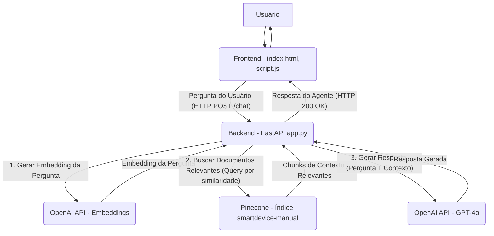

# Agente de IA

Um agente de IA para atendimento em uma interface web com base em documentos PDF.

O objetivo desse projeto é aprender à usar um agente de IA para atender usuários com base em conhecimentos específicos sobre algo sem precisar de uma pessoa para realizar tal procedimento ou pelo menos minimizar a necessidade de uma interação direta de uma pessoa.


## Tecnologias utilizadas

- Python
- FastAPI
- Pinecone 
- LangChain 
- OpenAI GPT-4o
- HTML/CSS
- JavaScript 
## Funcionalidades

- Ingestão de PDFs
- Busca semântica
- Geração de respostas contextualizadas

## Arquitetura do Sistema

O diagrama abaixo mostra o fluxo de dados da aplicação:



## Descrição do Fluxo

1. O usuário faz uma pergunta através do frontend
2. O frontend envia a pergunta para o backend via HTTP POST
3. O backend gera um embedding da pergunta usando a OpenAI API
4. O embedding é usado para buscar documentos relevantes no Pinecone
5. Os chunks de contexto são enviados junto com a pergunta para o GPT-4o
6. A resposta gerada é retornada ao frontend e exibida ao usuário
## Como Começar

Siga estas instruções para configurar e executar o projeto em seu ambiente de desenvolvimento.

#### Pré-requisitos

Certifique-se de ter as seguintes ferramentas instaladas em sua máquina:

  * **Python 3.9+**: Linguagem de programação para o backend.
      * [Download Python](https://www.python.org/downloads/)
      * Durante a instalação no Windows, marque a opção "Add Python to PATH".
  * **Node.js e npm**: Necessário para ferramentas de frontend (mesmo que este projeto use JavaScript/HTML/CSS simples, `npm` é útil para outras dependências futuras ou ferramentas de build).
      * [Download Node.js](https://nodejs.org/en/download/) (Recomendado versão LTS)
  * **VS Code (Visual Studio Code)**: IDE recomendada para o desenvolvimento deste projeto, com excelente suporte para Python, JavaScript/TypeScript e HTML/CSS.
      * [Download VS Code](https://code.visualstudio.com/)

#### 1\. Configuração do Ambiente Python

1.  **Clone o Repositório** (ou crie a pasta do projeto e navegue até ela):

    ```bash
    git clone git@github.com:yuri-moraes/agente-ia.git
    cd agente-ia-web # Ou o nome da sua pasta de projeto
    ```

    *Se você não está usando Git, simplesmente crie uma pasta chamada `agente-ia-web` e coloque todos os arquivos dentro dela.*

2.  **Crie um Ambiente Virtual**:
    É uma boa prática isolar as dependências do seu projeto.

    ```bash
    python -m venv venv
    ```

3.  **Ative o Ambiente Virtual**:

      * **No Windows**:
        ```bash
        .\venv\Scripts\activate
        ```
      * **No macOS/Linux**:
        ```bash
        source venv/bin/activate
        ```

    Você verá `(venv)` no início da linha de comando, indicando que o ambiente está ativo.

4.  **Instale as Dependências Python**:

    ```bash
    pip install -r requirements.txt
    ```

#### 2\. Configuração das Variáveis de Ambiente

As chaves de API e configurações sensíveis são carregadas de um arquivo `.env`.

1.  Na raiz do seu projeto, crie um arquivo chamado `.env`.
2.  Adicione as seguintes variáveis, substituindo os valores pelos seus:
    ```
    OPENAI_API_KEY="sua_chave_da_openai_aqui"
    PINECONE_API_KEY="sua_chave_do_pinecone_aqui"
    PINECONE_ENVIRONMENT="sua_regiao_pinecone_aqui" # Ex: us-east-1, gcp-starter
    ```
      * Você pode obter sua `OPENAI_API_KEY` no [painel da OpenAI](https://platform.openai.com/account/api-keys).
      * Sua `PINECONE_API_KEY` e `PINECONE_ENVIRONMENT` (que é a sua região, ex: `us-east-1`) podem ser encontradas no seu [painel do Pinecone](https://www.google.com/search?q=https://app.pinecone.io/dashboard/indexes).

#### 3\. Ingestão dos Dados (Processamento do PDF)

Este passo processará seus documentos PDF, gerará embeddings e os armazenará no Pinecone, criando a base de conhecimento do seu agente.

1.  **Coloque seu(s) arquivo(s) PDF** (ex: `manual_do_produto.pdf`) na mesma pasta raiz do projeto.
2.  Execute o script de ingestão:
    ```bash
    python ingest_data.py
    ```
    Este script criará (se ainda não existir) e populará o índice `smartdevice-manual` no seu Pinecone. Aguarde a mensagem de "Processamento completo\!".

#### 4\. Executando o Backend (API FastAPI)

O backend é a API que seu frontend irá consultar para interagir com o agente de IA.

1.  Certifique-se de que seu ambiente virtual esteja ativo.
2.  No terminal, execute o servidor FastAPI:
    ```bash
    python app.py
    ```
##### Ou use:

  uvicorn app:app --reload --host 0.0.0.0 --port 8000

  * O servidor estará disponível em `http://localhost:8000`.
  * Você pode acessar a documentação interativa da API em `http://localhost:8000/docs`. Mantenha este terminal aberto enquanto estiver usando o frontend.

#### 5\. Executando o Frontend (Interface Web)

O frontend é a página web que o usuário final verá e interagirá.

1.  No seu explorador de arquivos, navegue até a raiz do seu projeto.
2.  Clique duas vezes no arquivo `index.html` para abri-lo em seu navegador web padrão.
      * **Dica:** Se você usa o VS Code, pode instalar a extensão "Live Server" para servir o `index.html` e ter recarregamento automático do navegador durante o desenvolvimento.

Agora você deve ter seu agente de IA funcionando\! Você pode digitar perguntas na interface web e ver as respostas geradas com base nos seus documentos.

## Estrutura de Arquivos

```bash
agente-ia-web/
├── .env               # Variáveis de ambiente
├── app.py
├── ingest_data.py
├── index.html
├── script.js
├── style.css
├── requirements.txt   # Lista de dependências Python
├── README.md          # Visão geral do projeto e como usá-lo
```
## Melhorias Futuras

Como o projeto é apenas para aprendizagem (por enquanto), é importante deixar esse projeto online para qque qualquer um possa testar. Porém alguém má intencionado pode gastar tokens excessivamente e gastar todo meu budget. Então para que isso não interfira no objetivo de colocar o projeto no ar, precisa de algumas melhorias.

- Limite de uso
- Endpoints para testar o estado atual da API
- Respostas "boleanas" dependendo da pergunta do usuário
- Incluir respostas específicas dependendo da pergunta do usuário

### Exemplo:

#### User: Qual o valor de produto x? 
#### System: O valor do produto depende de modelo, qual modelo se refere?

Com base na resposta do usuário, deve-se responder. Mas isto talvez seja uma melhoria desnecessária. Se o modelo da OpenAI já fizer isso, se torna desnecessário.
